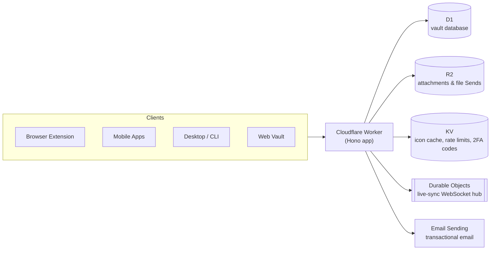

# Vaultur

**A Bitwarden-compatible password manager server that runs entirely on
Cloudflare — no VM, no container, no database to patch.**

[](LICENSE)


[](https://github.com/nommyt/vaultur)

Vaultur speaks the real Bitwarden API, so the official clients — browser
extensions, mobile apps, desktop, CLI, and the web vault — work against it
unmodified, as a self-hosted server. It's written in TypeScript on
[Hono](https://hono.dev) and deploys as a single Cloudflare Worker backed by
D1, R2, KV, Durable Objects, and Email Sending.

Inspired by [vaultwarden](https://github.com/dani-garcia/vaultwarden) (the
API surface and behavior are ported from it, field for field) and
[warden-worker](https://github.com/qaz741wsd856/warden-worker) (the
deploy-and-forget Cloudflare architecture), rebuilt from scratch in
TypeScript with full organization support.

## Why Vaultur

Running vaultwarden means owning a server: a box or container that needs
patching, a database that needs backing up, and capacity you pay for whether
you use it or not. Vaultur pushes all of that onto Cloudflare's platform —
there's no process to keep alive and no OS to patch, and the whole thing
fits inside Cloudflare's free tier for personal/small-team use.

|                                                         | vaultwarden                                      | Vaultur                                                             |
| ------------------------------------------------------- | ------------------------------------------------ | ------------------------------------------------------------------- |
| Runtime                                                 | Rust binary / Docker container you run and patch | Cloudflare Worker — no server to manage                             |
| Database                                                | SQLite, MySQL, or PostgreSQL                     | D1 (SQLite at the edge)                                             |
| Attachments / cache                                     | Local disk or S3 via opendal                     | R2 + KV, native bindings                                            |
| Scaling                                                 | Manual — bigger box, more replicas               | Automatic, edge-distributed                                         |
| Typical cost, small team                                | A VPS, running 24/7                              | Cloudflare free tier                                                |
| Organizations, Send, emergency access, 2FA (TOTP/email) | ✅                                               | ✅                                                                  |
| Admin panel                                             | ✅                                               | ✅ ported                                                           |
| SSO / WebAuthn / Duo / YubiKey OTP                      | ✅                                               | ❌ not (yet) supported — see [Roadmap](#roadmap--not-yet-supported) |

If you need SSO or hardware 2FA today, stick with vaultwarden. Otherwise,
Vaultur trades a small, well-defined set of features for zero ops burden.

## Architecture



One Worker handles the API, the WebSocket upgrade for live sync, and serves
the web vault's static assets — everything in the diagram above is a native
Cloudflare binding, not a third-party dependency.

## Features

- **Identity**: register, prelogin, OAuth2 password grant, refresh tokens,
  API-key login, login-with-device (auth requests), new-device alerts
- **Vault**: sync, ciphers (all 5 types incl. SSH keys), folders, favorites,
  archives, soft-delete/restore, import, purge, per-cipher keys
- **Attachments** on R2 (both the v2 signed upload flow and the older flow
  some clients still use)
- **Bitwarden Send** (text + file, passwords, access limits)
- **Two-factor**: authenticator TOTP, email codes, recovery codes,
  remember-device tokens
- **Organizations**: collections, member lifecycle (invite → accept →
  confirm), roles incl. custom/manager, groups, policies (2FA, master
  password, single-org, personal-ownership, disable-send)
- **Emergency access** (view + takeover)
- **Live sync** via SignalR-compatible WebSockets on Durable Objects,
  plus mobile push relay
- **Email** via the Cloudflare Email Sending binding (no SMTP server) —
  requires a domain on Cloudflare DNS; without one, Vaultur runs in
  no-mail mode
- **Admin API**, icon proxy with KV cache, event logs, scheduled cleanup jobs
- **Web vault**: serves the official client (bw_web_builds) as static assets

## Quick start

```bash
pnpm install
cp .dev.vars.example .dev.vars     # set JWT_SECRET
pnpm db:migrate:local && pnpm dev  # http://localhost:8787
```

Point any Bitwarden client (extension, mobile, desktop, CLI) at
`http://localhost:8787` as a self-hosted server to try it locally.

### Deploy your own

```bash
pnpm wrangler login
pnpm wrangler d1 create vaultur                       # paste the id into wrangler.jsonc
pnpm wrangler kv namespace create VAULTUR_KV          # paste the id into wrangler.jsonc
pnpm wrangler r2 bucket create vaultur-files
openssl rand -base64 64 | tr -d '\n' | pnpm wrangler secret put JWT_SECRET
pnpm db:migrate:remote
pnpm deploy
```

That's the minimum to get a running server on the Cloudflare free tier. For
email sending, a custom domain, mobile push, and the full configuration
reference, see **[docs/deployment.md](docs/deployment.md)**.

## Repo layout

A single Hono worker project:

```
src/              Worker source (Hono app, API routes, services)
  src/api/        Route handlers (23 modules — identity, vault, orgs, admin, ...)
  src/services/   Business logic (14 modules — auth, mail, push, ssrf, ...)
  src/db/         Drizzle ORM schema for D1 (1:1 port of vaultwarden's schema)
  src/shared/     Protocol enums/constants
test/             Vitest integration tests (real workerd)
migrations/       Generated D1 migrations
scripts/          web-vault fetch/bootstrap helpers
docs/             Deployment guide and test/parity notes
public/           Web vault static assets (bw_web_builds, fetched separately)
wrangler.jsonc    Worker + bindings config
```

The web vault UI is the official Bitwarden client (Vaultwarden's
[bw_web_builds](https://github.com/dani-garcia/bw_web_builds) patch set),
served by the Worker as static assets — no custom client is maintained here.

## Testing

Integration tests run the real Worker in workerd via
`@cloudflare/vitest-pool-workers` — D1, KV, R2 and Durable Objects included,
not mocked:

```bash
pnpm test
```

See **[docs/testing.md](docs/testing.md)** for what's covered and how it
maps to vaultwarden's own test suite.

## Roadmap / not (yet) supported

Deliberately out of scope for now — the web vault surfaces some of this UI,
but the endpoints return a clear "not available" rather than silently
misbehaving:

- **SSO / OpenID Connect**
- **Hardware / advanced 2FA**: WebAuthn/FIDO2, Duo, YubiKey OTP
- **Admin-panel DB backup/restore** — use Cloudflare's D1
  [time travel](https://developers.cloudflare.com/d1/reference/time-travel/)
  or `wrangler d1 export` instead

Contributions that close any of these gaps are welcome — see below.

## Contributing

Issues and PRs are welcome. A few things that'll save you a round-trip:

- Read **[CLAUDE.md](CLAUDE.md)** first — it documents the conventions this
  codebase leans on (error envelopes, request-body parsing, admin-settings
  wiring, etc.), useful whether or not you're using an AI coding agent.
- [lefthook](https://lefthook.dev) git hooks enforce checks locally. Run
  `pnpm exec lefthook install` once per clone; it wires up
  `pnpm format:check` + `pnpm typecheck` on commit and `pnpm build` +
  `pnpm test` on push.
- New behavior needs a test in `test/*.spec.ts` (real workerd, not mocks —
  see [docs/testing.md](docs/testing.md)) and `pnpm format` before you push.
- Schema changes go in `src/db/schema.ts`, then `pnpm db:generate`. Never
  hand-edit the generated SQL under `migrations/`.

## License

[AGPL-3.0](LICENSE) — same as vaultwarden, whose behavior this project
ports. Bitwarden is a trademark of Bitwarden, Inc. This project is not
affiliated with or endorsed by Bitwarden, Inc.
