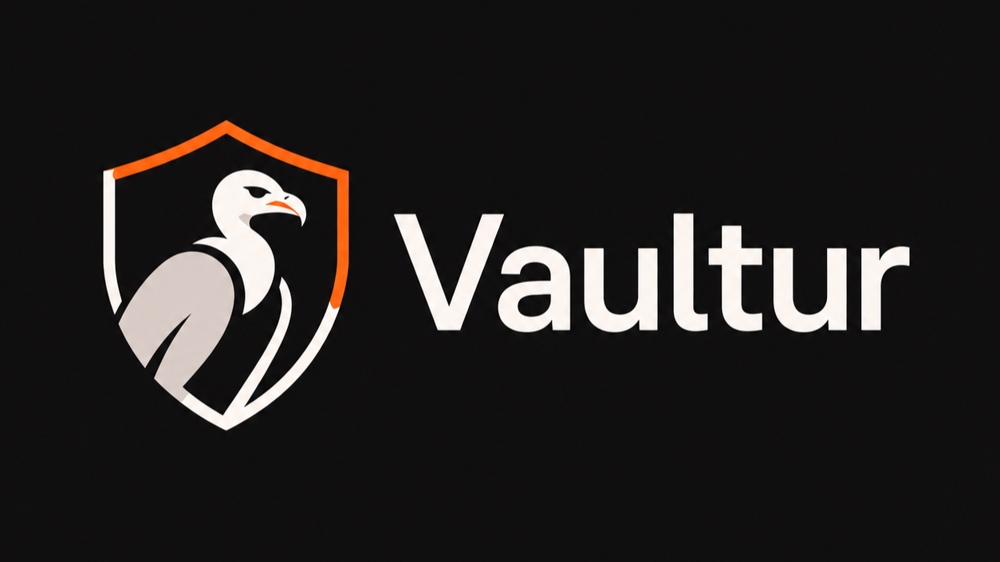
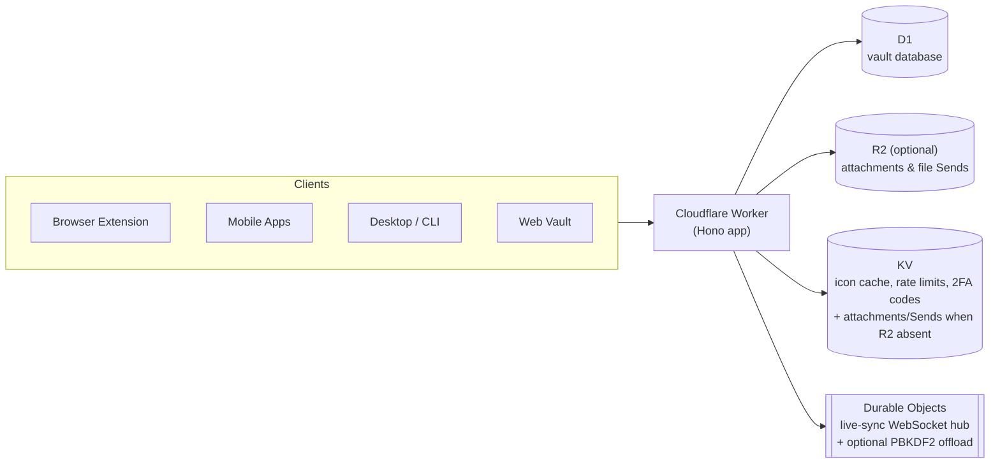

# Vaultur

<p align="center">
  
</p>

**A Bitwarden-compatible password manager server that runs entirely on
Cloudflare — no VM, no container, no database to patch.**

[](https://github.com/nommyt/vaultur/actions/workflows/ci.yml)
[](LICENSE)


[](https://github.com/nommyt/vaultur)

Vaultur speaks the real Bitwarden API, so the official clients — browser
extensions, mobile apps, desktop, CLI, and the web vault — work against it
unmodified, as a self-hosted server. It's written in TypeScript on
[Hono](https://hono.dev) and deploys as a single Cloudflare Worker backed by
D1, KV, Durable Objects, and Email Sending — R2 is an optional upgrade for
larger attachments (see below).

Inspired by [vaultwarden](https://github.com/dani-garcia/vaultwarden) (the
API surface and behavior are ported from it, field for field) and
[warden-worker](https://github.com/qaz741wsd856/warden-worker) (the
deploy-and-forget Cloudflare architecture), rebuilt from scratch in
TypeScript with full organization support.

**Full vaultwarden parity.** Every route in vaultwarden's API is implemented
and enforced by an [automated parity test](test/route-parity.spec.ts) that
fires a request at all ~245 of them. That includes the pieces vaultwarden
gained most recently — WebAuthn, Duo and YubiKey two-factor, and OpenID
Connect SSO. Configuration defaults mirror vaultwarden, so an existing
deployment behaves the same way.

**Full self-hosted feature set.** Vaultur runs the same organization and
enterprise-oriented features as vaultwarden — groups, event logs, SSO, hardware
2FA — configured the same way, with the same defaults (see
[Organization and enterprise features](#organization-and-enterprise-features)).

## Why Vaultur

Running vaultwarden means owning a server: a box or container that needs
patching, a database that needs backing up, and capacity you pay for whether
you use it or not. Vaultur pushes all of that onto Cloudflare's platform —
there's no process to keep alive and no OS to patch, and the whole thing
fits inside Cloudflare's free tier for personal/small-team use.

|                                       | vaultwarden                                      | Vaultur                                   |
| ------------------------------------- | ------------------------------------------------ | ----------------------------------------- |
| Runtime                               | Rust binary / Docker container you run and patch | Cloudflare Worker — no server to manage   |
| Database                              | SQLite, MySQL, or PostgreSQL                     | D1 (SQLite at the edge)                   |
| Attachments / cache                   | Local disk or S3 via opendal                     | KV by default, R2 opt-in, native bindings |
| Scaling                               | Manual — bigger box, more replicas               | Automatic, edge-distributed               |
| Typical cost, small team              | A VPS, running 24/7                              | Cloudflare free tier                      |
| Organizations, Send, emergency access | ✅                                               | ✅                                        |
| 2FA: TOTP, email                      | ✅                                               | ✅                                        |
| 2FA: WebAuthn, Duo, YubiKey OTP       | ✅                                               | ✅                                        |
| SSO (OpenID Connect)                  | ✅                                               | ✅                                        |
| Org groups & event logs               | ✅ (off by default)                              | ✅ (off by default, matches vaultwarden)  |
| Admin panel                           | ✅                                               | ✅ ported + Cloudflare-specific settings  |
| Email transport                       | Any SMTP server                                  | Cloudflare Email Sending (no SMTP server) |

Vaultur trades one thing for zero ops burden: mail goes through Cloudflare
Email Sending (so you need a domain on Cloudflare DNS) instead of an arbitrary
SMTP server. Everything else vaultwarden does, Vaultur does.

## Architecture



One Worker handles the API, the WebSocket upgrade for live sync, and serves
the web vault's static assets — everything in the diagram above is a native
Cloudflare binding, not a third-party dependency.

## Features

- **Identity**: register, prelogin, OAuth2 password grant, refresh tokens,
  API-key login, login-with-device (auth requests), new-device alerts
- **Vault**: sync, ciphers (all 5 types incl. SSH keys), folders, favorites,
  archives, soft-delete/restore, import, purge, per-cipher keys
- **Attachments** (both the v2 signed upload flow and the older flow some
  clients still use), stored in KV by default or R2 when bound — see
  [Storage: KV vs R2](#storage-kv-vs-r2)
- **Bitwarden Send** (text + file, passwords, access limits)
- **Two-factor**: authenticator TOTP, email codes, **WebAuthn/FIDO2**, **Duo**
  (Universal Prompt), **YubiKey OTP**, recovery codes, remember-device tokens
- **SSO** via OpenID Connect — discovery, PKCE, id_token verification against
  the provider's JWKS, and account linking; works with the official clients'
  SSO login button
- **Organizations**: collections, member lifecycle (invite → accept →
  confirm), roles incl. custom/manager, groups, account recovery (admin
  reset-password), policies (2FA, master password, single-org,
  personal-ownership, disable-send, and more)
- **Emergency access** (view + takeover)
- **Event logs** and the directory-connector public import (LDAP/SCIM-style)
- **Live sync** via SignalR-compatible WebSockets on Durable Objects,
  plus mobile push relay
- **Email** via the Cloudflare Email Sending binding (no SMTP server) —
  requires a domain on Cloudflare DNS; without one, Vaultur runs in
  no-mail mode
- **Admin panel** (vaultwarden's, ported to Hono JSX), icon proxy with KV
  cache, scheduled cleanup jobs
- **Web vault**: serves the official client
  ([bw_web_builds](https://github.com/dani-garcia/bw_web_builds)) as static
  assets, with vaultwarden's standard styling

## Organization and enterprise features

Vaultur implements the same organization and enterprise-oriented features as
vaultwarden — organization groups, event/audit logs, SSO, and the hardware 2FA
providers — configured exactly as in vaultwarden, with the same environment
variables and the same defaults, and adjustable from the admin Settings page.

| Feature                      | Default (matches vaultwarden) | Setting                                            |
| ---------------------------- | ----------------------------- | -------------------------------------------------- |
| Organization groups          | off                           | `ORG_GROUPS_ENABLED`                               |
| Event / audit logs           | off                           | `ORG_EVENTS_ENABLED`                               |
| SSO (OpenID Connect)         | off (opt-in)                  | `SSO_ENABLED`                                      |
| WebAuthn / Duo / YubiKey 2FA | on (needs credentials)        | `_ENABLE_DUO` / `_ENABLE_YUBICO` / auto (WebAuthn) |
| Email 2FA                    | on when mail is configured    | `_ENABLE_EMAIL_2FA`                                |
| Emergency access, Sends      | on                            | `EMERGENCY_ACCESS_ALLOWED` / `SENDS_ALLOWED`       |

Like vaultwarden, groups and event logs are off until you turn them on. If the
hosted Bitwarden service fits your needs, consider
[supporting Bitwarden](https://bitwarden.com/pricing/) — they build and maintain
the apps and protocol this project relies on.

## Admin panel

The admin panel is a Hono-JSX port of vaultwarden's (`/admin`, gated on the
`ADMIN_TOKEN` secret — the whole surface 404s until it's set). It's
vaultwarden-parity first: user and organization management, diagnostics, and a
live-editable settings page whose values are persisted in D1 and layered over
the env config, so you can change settings without redeploying. Admin login
attempts are rate-limited per IP, and the Settings page warns if `ADMIN_TOKEN`
is short enough to be brute-forceable — use a long random value (e.g.
`openssl rand -base64 48`).

On top of vaultwarden's settings it adds the Cloudflare- and Vaultur-specific
bits: the Cloudflare Email Sending transport (Vaultur's mail path, in place of
SMTP host/port/credentials), plus toggles for the features vaultwarden doesn't
have yet — SSO (OpenID Connect), and per-provider enables for WebAuthn, Duo,
and YubiKey — and the free-by-default org groups / event-log switches.

## Crypto (PBKDF2)

Bitwarden clients derive a master-password hash, then the server hashes it
again with PBKDF2 before storing it. workerd caps native PBKDF2 (both WebCrypto
and `node:crypto`) at 100k iterations in production
([workerd#1346](https://github.com/cloudflare/workerd/issues/1346)), which is
well below vaultwarden's 600k default, and pure-JS hashing is CPU-heavy. So
Vaultur does not hash in the request Worker at all: the PBKDF2 derivation runs
in the `HeavyCompute` Durable Object (`VAULTUR_HEAVY` binding) via
[`@noble/hashes`](https://github.com/paulmillr/noble-hashes) (pure JS, no cap),
which has a 30s CPU budget — free-tier friendly and transparent to callers.
SHA-256 and HMAC still use `node:crypto` (no cap there).

The `VAULTUR_HEAVY` binding is **required** — the committed `wrangler.jsonc`
already declares it, and the Worker returns a 500 if it is missing.

## Quick start

```bash
pnpm install
cp .env.example .env
perl -i -pe 's#^JWT_SECRET=.*#JWT_SECRET="'"$(openssl rand -base64 64 | tr -d '\n')"'"#' .env
pnpm db:migrate:local && pnpm dev  # http://localhost:8787
```

Point any Bitwarden client (extension, mobile, desktop, CLI) at
`http://localhost:8787` as a self-hosted server to try it locally. Vaultur
refuses to serve requests (500, logged) if `JWT_SECRET` is missing, too short,
or still the `.env.example` placeholder — every auth token is signed with it,
so there's no safe way to run without a real one.

To also try the [admin panel](#admin-panel) locally (optional — the surface
404s until `ADMIN_TOKEN` is set):

```bash
perl -i -pe 's#^ADMIN_TOKEN=.*#ADMIN_TOKEN="'"$(openssl rand -base64 48 | tr -d '\n')"'"#' .env
```

### Deploy your own

```bash
pnpm wrangler login
pnpm wrangler d1 create vaultur                       # paste the id into wrangler.jsonc
pnpm wrangler kv namespace create VAULTUR_KV          # paste the id into wrangler.jsonc
openssl rand -base64 64 | tr -d '\n' | pnpm wrangler secret put JWT_SECRET
pnpm db:migrate:remote
pnpm deploy
```

That's the minimum to get a running server on the Cloudflare free tier —
attachments and file Sends work out of the box, stored in KV (25 MiB/file
cap). For R2 storage (500 MB/file, needs a paid Cloudflare plan), email
sending, a custom domain, mobile push, and the full configuration reference,
see **[docs/deployment.md](docs/deployment.md)**.

### Deploy via Cloudflare Dashboard (Git integration)

Prefer not to touch the CLI? Cloudflare can build and deploy straight from
this repo: **"Create Worker" → import a Git repository**, point it at your
fork, and override the auto-detected commands — the auto-detected Deploy
command is a bare `wrangler deploy`, which silently skips D1 migrations:

- **Build command**: `pnpm install && pnpm run web-vault:fetch`
- **Deploy command**: `pnpm deploy`

Two things the free tier needs added before the first deploy succeeds:

- **`GITHUB_TOKEN`** — add as a **Build variable** (Settings → Build →
  environment variables/secrets for your build, _not_ the runtime tab). A
  GitHub personal access token (no scopes needed for a public repo) — without
  it, Cloudflare's shared build fleet trips GitHub's 60 requests/hour
  unauthenticated rate limit fetching the web vault release, failing the
  build with `curl: (22) ... 403`.
- **`JWT_SECRET`** — add as a runtime secret (Settings → Variables & Secrets).
  Every auth token is signed with it; Vaultur refuses all requests (500)
  without one.

The auto-generated API token this flow provisions also needs **D1 Edit**
permission for the migration step, and since this path never sees the
gitignored `wrangler.deploy.jsonc`, real D1/KV/R2 resource IDs go directly
into the committed `wrangler.jsonc`. Full detail and troubleshooting:
**[docs/deployment.md](docs/deployment.md#cloudflares-native-git-integration-workers-builds)**.

### Storage: KV vs R2

File storage picks its backend automatically from `wrangler.jsonc`: if the
`VAULTUR_FILES` R2 binding is present, attachments and file Sends go to R2
(500 MB/file); if it's absent, they fall back to the `VAULTUR_KV` binding
(25 MiB/file, and reads are eventually consistent — a just-uploaded file can
briefly 404 from another edge location). There's no config toggle — add or
remove the `r2_buckets` block in `wrangler.jsonc` (and run
`pnpm wrangler r2 bucket create vaultur-files` once) to switch backends.

## Repo layout

A single Hono worker project:

```
src/              Worker source (Hono app, API routes, services)
  src/api/        Route handlers (23 modules — identity, vault, orgs, admin, 2FA, ...)
  src/services/   Business logic (19 modules — auth, mail, push, sso, duo, webauthn, yubikey, ...)
  src/db/         Drizzle ORM schema for D1 (1:1 port of vaultwarden's schema)
  src/durable/    Durable Object classes (notifications hub, PBKDF2 offload)
  src/shared/     Protocol enums/constants
test/             Vitest integration tests (real workerd), incl. route-parity check
migrations/       Generated D1 migrations
scripts/          web-vault fetch/bootstrap helpers
docs/             Deployment guide and test/parity notes
public/           Web vault static assets (bw_web_builds, fetched separately)
wrangler.jsonc    Worker + bindings config
```

The web vault UI is the official Bitwarden client (Vaultwarden's
[bw_web_builds](https://github.com/dani-garcia/bw_web_builds) patch set),
served by the Worker as static assets — no custom client is maintained here.

## Testing

Integration tests run the real Worker in workerd via
`@cloudflare/vitest-pool-workers` — D1, KV, R2 and Durable Objects included,
not mocked:

```bash
pnpm test                  # all tests except Durable Object offload tests
pnpm test:heavy            # Durable Object PBKDF2 offload tests (separate config)
pnpm test:freetier         # attachments/sends specs with no R2 binding (KV fallback)
```

Every vaultwarden route is covered by an automated parity test
([test/route-parity.spec.ts](test/route-parity.spec.ts)) that fires a request
at all ~245 of them and fails if any is missing. External services (YubiCloud,
Duo, OIDC providers) are mocked at the fetch layer with real signatures, so the
2FA/SSO verification paths run for real. See
**[docs/testing.md](docs/testing.md)** for the full map.

## Implementation notes

A few deliberate deviations from vaultwarden, made for the Workers platform or
because the upstream behavior is itself legacy:

- **Duo** uses the modern Universal Prompt (OIDC) flow only. Duo retired the
  legacy iframe prompt in 2024; vaultwarden keeps it behind an off-by-default
  flag, which Vaultur does not carry.
- **SSO** authenticates the login and then issues Vaultur's own access/refresh
  tokens (equivalent to vaultwarden's `SSO_AUTH_ONLY_NOT_SESSION=true`); binding
  session validity to the IdP's refresh tokens is not implemented.
- **Dependencies** are chosen to match the protocol rather than reinvent it:
  [`@simplewebauthn/server`](https://simplewebauthn.dev) for FIDO2 (pure
  WebCrypto), [`jose`](https://github.com/panva/jose) for OIDC id_token
  verification, and [`@noble/hashes`](https://github.com/paulmillr/noble-hashes)
  for uncapped PBKDF2. `node:*` built-ins are used everywhere they fit.

## Non-goals

Vaultur targets vaultwarden parity. A few things are deliberately out of scope:

- **Admin-panel DB backup/restore** (`/admin/config/backup_db`) — a SQLite
  file copy that has no meaning on D1. Use Cloudflare's D1
  [time travel](https://developers.cloudflare.com/d1/reference/time-travel/)
  or `wrangler d1 export` instead.
- **Enterprise machinery that lives only in the proprietary bitwarden/server**
  and that vaultwarden does not implement either: Secrets Manager, native SCIM
  (the public directory-connector import covers the same need), passkey _login_
  as a primary factor (WebAuthn as a second factor is fully supported), Key
  Connector, and billing/subscriptions.

## Support

- **Documentation:** [docs/](docs/) for deployment, testing, and parity notes.
- **Issues & feature requests:** [GitHub Issues](https://github.com/nommyt/vaultur/issues)
  (search existing issues first).
- **Discussions:** Use GitHub Discussions for questions, ideas, and community
  conversation.

## Security

Report security vulnerabilities privately through
[GitHub Security Advisories](https://github.com/nommyt/vaultur/security/advisories/new).
Do **not** open a public issue.

Only the Worker itself (`src/`) and its build/test tooling are in scope. The
bundled web vault is an unmodified official Bitwarden client — report upstream
issues to Bitwarden.

## Contributing

Issues and PRs are welcome — see **[CONTRIBUTING.md](CONTRIBUTING.md)** for
setup, testing conventions, and the PR checklist.

## License

[AGPL-3.0](LICENSE) — same as vaultwarden, whose behavior this project
ports. Bitwarden is a trademark of Bitwarden, Inc. This project is not
affiliated with or endorsed by Bitwarden, Inc.
